| Content | Screenshot |
| --- | --- |
| One starts by creating a container within their BLOB store. A memorable name should be assigned; in this instance, the BLOB is named 'sustainability reports' as documents related to sustainability will be uploaded. | 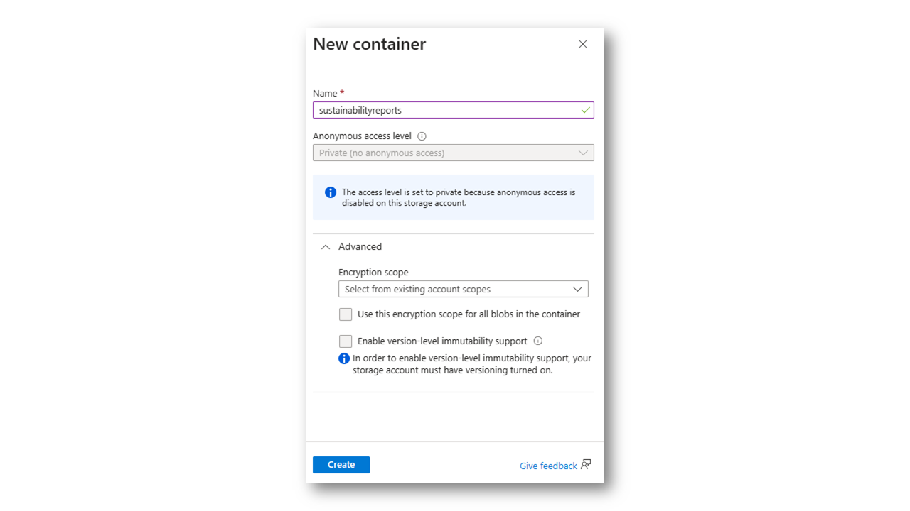 |
| Once the BLOB is created, all desired documents for indexing should be uploaded. For illustration, a 'Sustainability Victoria Annual Report' has been uploaded. However, the power of AI search allows for the upload and indexing of hundreds, thousands, or even millions of documents. | 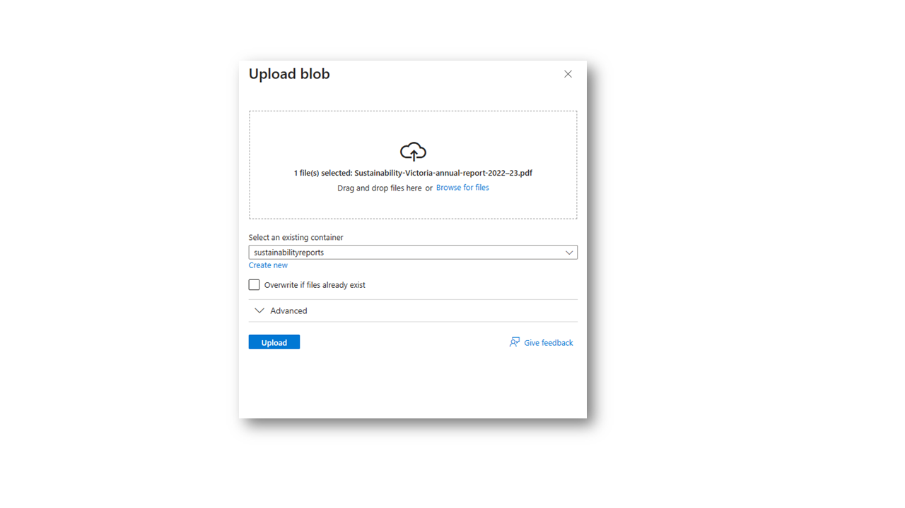 |
| AI Studio is opened and the 'import and vectorize data' icon is clicked, prompting a new window to open. | 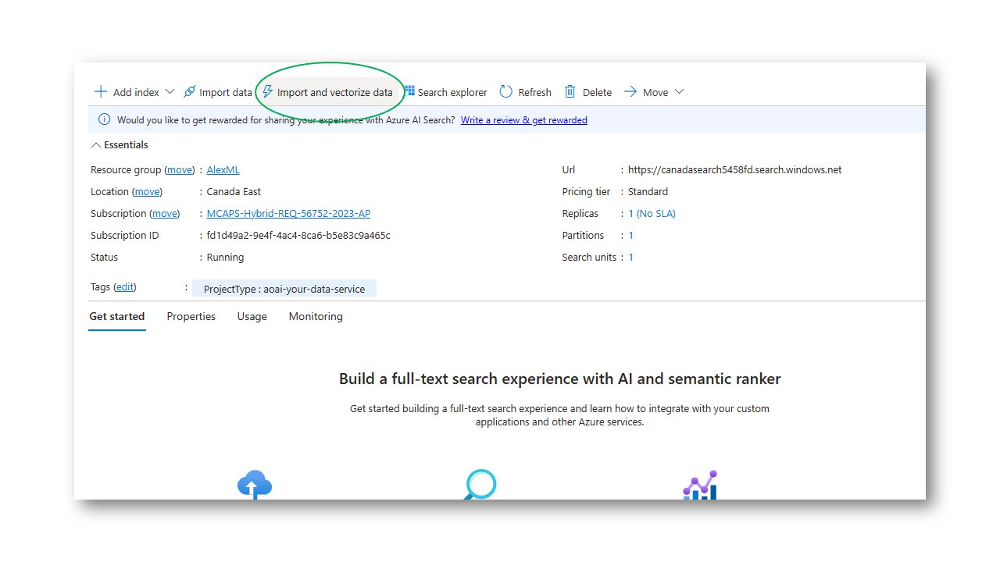 |
| The next step involves connecting to the BLOB store that was created earlier and vectorizing the data for enhanced search efficiency. | 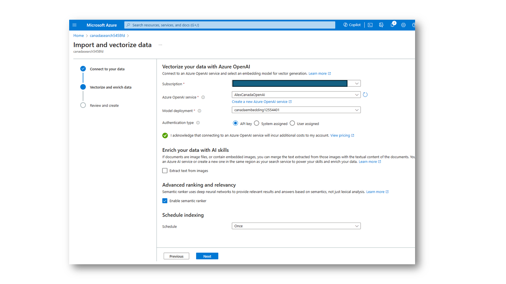 |
| The object's name prefix should be modified to something easily recalled. For instance, it's named 'sustainability-reports-vector' followed by a random number. Once satisfied with the name, 'create' is clicked. | 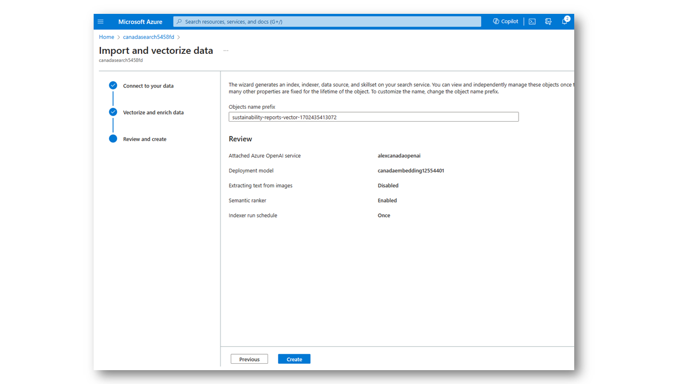 |
| A dialogue appears indicating that the documents are being indexed. Searching can commence immediately, but the indexing duration may vary depending on the number of documents. | 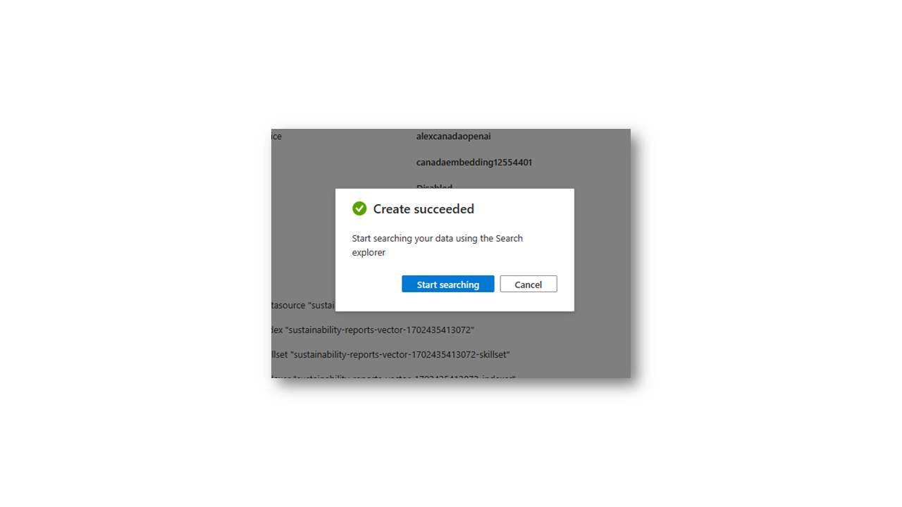 |
| One navigates to the Azure AI studio and enters the chat playground. Three main boxes are noticed. The first is the assistant setup, where the connection to the search index just created will be established. The second box is for asking questions, and the third box is for configuring the generated value, such as choosing the model to use, determining how long to store previous conversations in memory, and providing advice. | 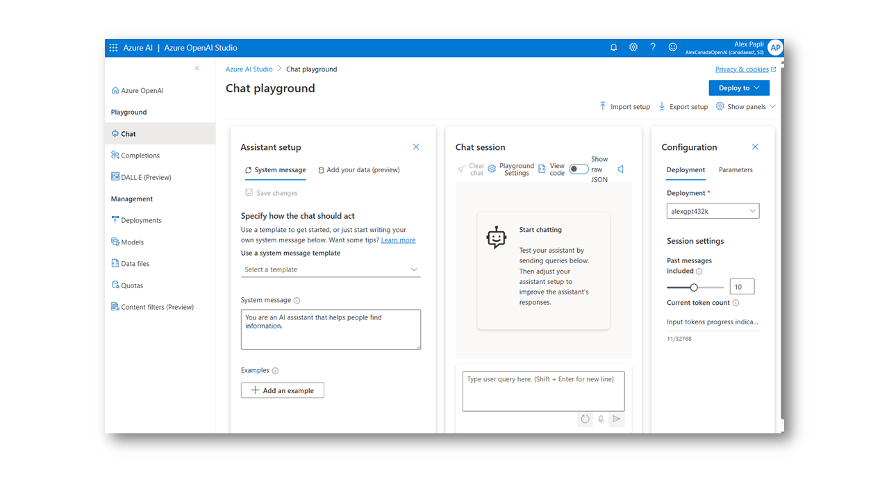 |
| In the first box, the 'add data' tab is clicked and the AI search index just created is selected. Vector search for the search resource should be enabled. Then, the embedding model needed for the search is presented. 'Next' is clicked afterward. | 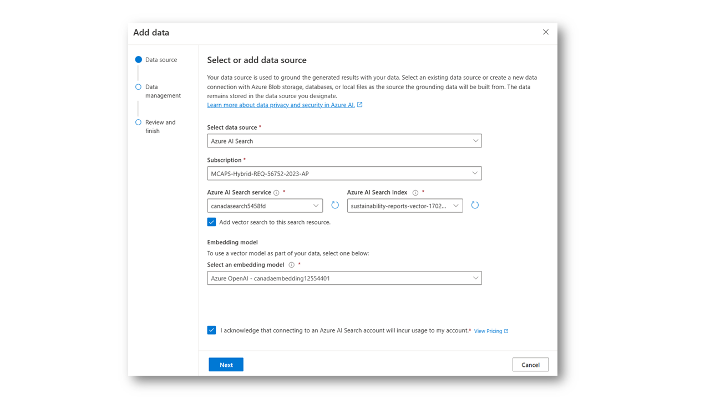 |
| Field mapping is what the generated AI uses to provide context for the response. The essential fields are the content data, which should be labeled 'chunk' for this day. The remaining fields, including file name (chunk ID), title, URL (parent ID), and vector fields, are less crucial but contribute to a more precise search result. | 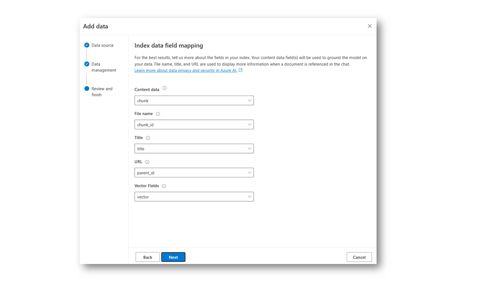 |
| For optimal search results, the 'hybrid and semantic search type' is selected and the existing semantic search configuration is chosen. In this instance, it's the 'semantic sustainability reports vector' created earlier. Then, the acknowledgment buttons are ticked and 'next' is clicked. | 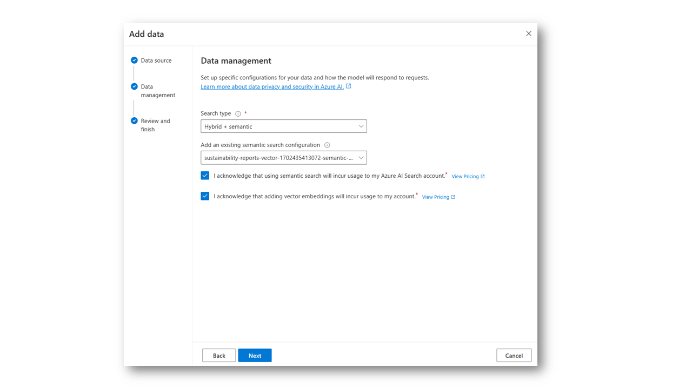 |
| The search settings are reviewed and, if satisfactory, the 'save and close' button is clicked. The search index is now connected for the demo. | 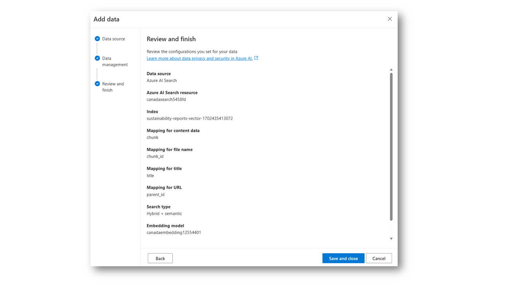 |
| The search's sensitivity can be determined. A strictness level of three usually works well. The 'retrieve documents' slider allows flexibility in the search results that the generated AI service will present. Given GPT's large context window, it's often beneficial to initially set the slider to 20 retrieved documents and adjust as needed. The optimal setting often depends on the breadth of the content that's been indexed. | 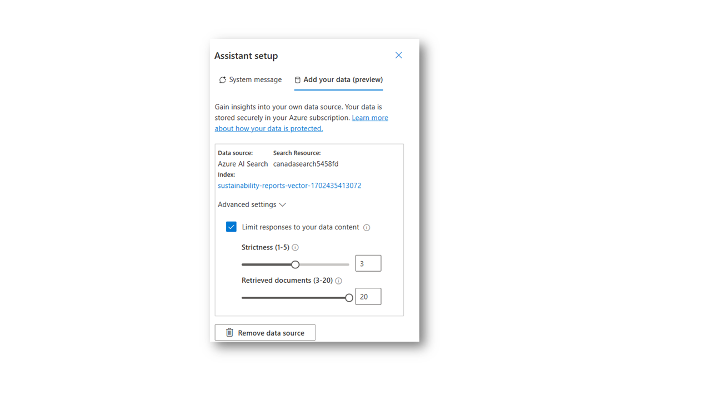 |
| One begins asking their data questions by typing them into the box. The question should be related to the content stored in the BLOB documents. AI search runs in the background, presenting the prompt with search results, which are then summarized and presented as an answer relevant to the initial question. | 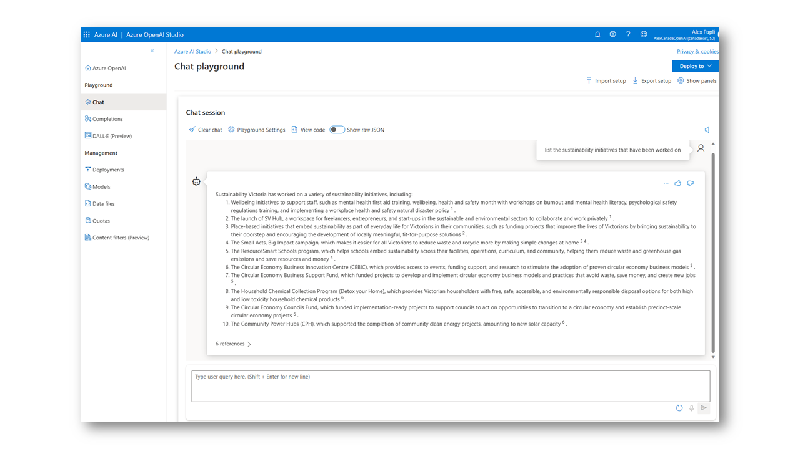 |
