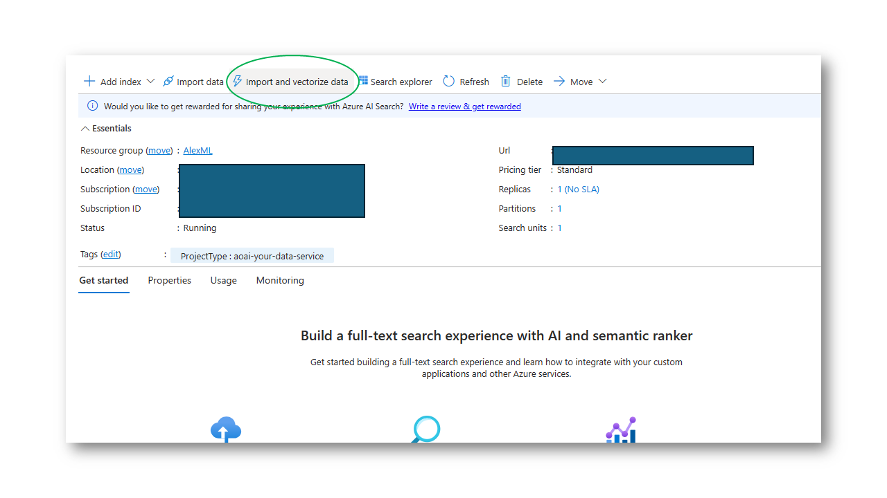
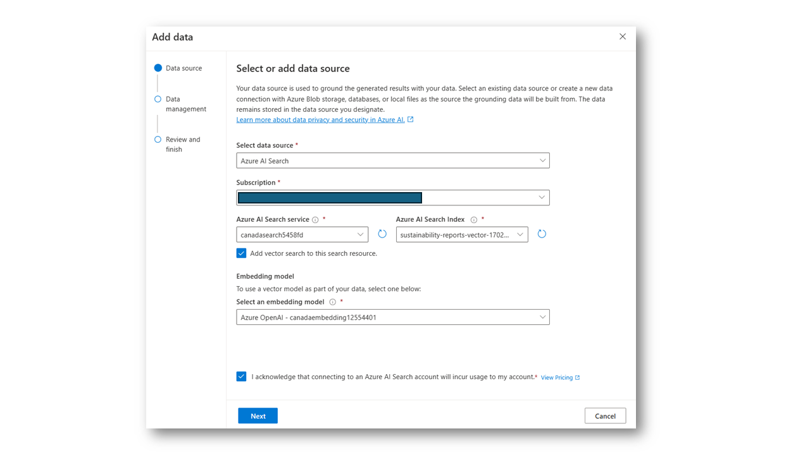

## Demo Instructions & Click Path
This page shows you how to configure and demo a simple RAG based solution using Azure Cognitive Services and Azure OpenAI without code.

### Prerequisites
1. A set of files you want to ask questions of. These should be primarily text based, pdf or .doc/docx format.
2. An Azure Blob Storage container - this is where the files will be stored.
3. An Azure AI Search service
4. An Azure OpenAI subscription

| Content | Screenshot |
| --- | --- |
| Create Blob Store & Upload Files |  |
| From within your Azure azure account, create a new Azure Storage account if you don't already have one. Go into this and create a new Blob storage container - this is where your files will go. A memorable name should be assigned; in this instance, the Blob is named 'sustainability reports' as documents related to sustainability will be uploaded. |  |
| Once the Blob container is created, all desired documents for indexing should be uploaded. For illustration, a 'Sustainability Victoria Annual Report' has been uploaded. However, the power of AI search allows for the upload and indexing of hundreds, thousands, or even millions of documents. |  |
| Configure AI Search Service |  |
| Open your AI Search service via the Azure Portal, and click the 'import and vectorize data' icon. |  |
| What we will do here is connect your search service to the Blob store that was created earlier and vectorize the data for enhanced search efficiency. Link to your blob file store and click through the wizard. |  |
| The object's name prefix should be modified to something easily recalled. For instance, here you can see the name 'sustainability-reports-vector' followed by a random number. Once satisfied with the name, 'create' is clicked. |  |
| A dialogue appears indicating that the documents are being indexed. Searching can commence immediately, but the indexing duration may vary depending on the number of documents. |  |
| Configure AI Chat Playground |  |
| Load the Chat Playground via your Azure OpenAI resource from the Azure console. Three main columns are shown in the main page content; The first is the assistant setup, where the connection to the search index just created will be established. The second box is for asking questions of your data, and the third box is for configuring the generated value, such as choosing the model to use, determining how long to store previous conversations in memory, and providing advice. |  |
| In the first box, click the 'add data' tab and select the AI search index you just created. Vector search for the search resource should be enabled. Then, the embedding model needed for the search is presented, from there you can click 'Next' to continue the setup. |  |
| Field mapping is what the generated AI uses to provide context for the response. The essential fields are the content data, which should be labeled 'chunk' for this day. The remaining fields, including file name (chunk ID), title, URL (parent ID), and vector fields, can be configured per this screenshot. |  |
| For optimal search results, the 'hybrid and semantic search type' is selected and the existing semantic search configuration is chosen. In this instance, it's the 'semantic sustainability reports vector' created earlier. Then tick the acknowledgment buttons and press 'next'. |  |
| Review your search settings then click the 'save and close' button. The search index is now connected! |  |
| The search's sensitivity can be modified in the "Assistant setup" box. A strictness level of three usually works well. The 'retrieve documents' slider allows flexibility in the search results that the generated AI service will present. Given GPT4's large context window, it's often beneficial to initially set the slider to 20 retrieved documents and adjust as needed. The optimal setting often depends on the breadth of the content that's been indexed. |  |
| Start Q&Aing your data! |  |
| Now begin asking questions of the files you previously uploaded. Your  question should be related to the content stored in the Blob documents. AI search runs in the background, presenting the prompt with search results, which are then summarized and presented as an answer relevant to the initial question. |  |
